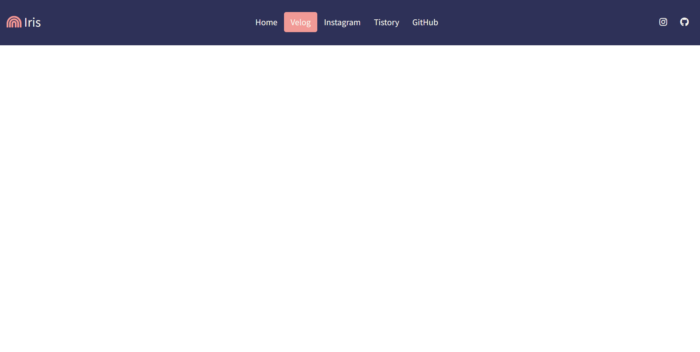

# Responsive Navigation Bar
|||
|-|-|

## About
간단한 JavaScript 이벤트 핸들러를 이용한 반응형 헤더(내비게이션 바).

## Stack
HTML, CSS, JavaScript

## Period
2021.8.20. ~ 2021.8.20.

## Roadmap
- [X] Write HTML of nav bar
- [X] Add CSS styling
- [X] Add an event handler with JS
